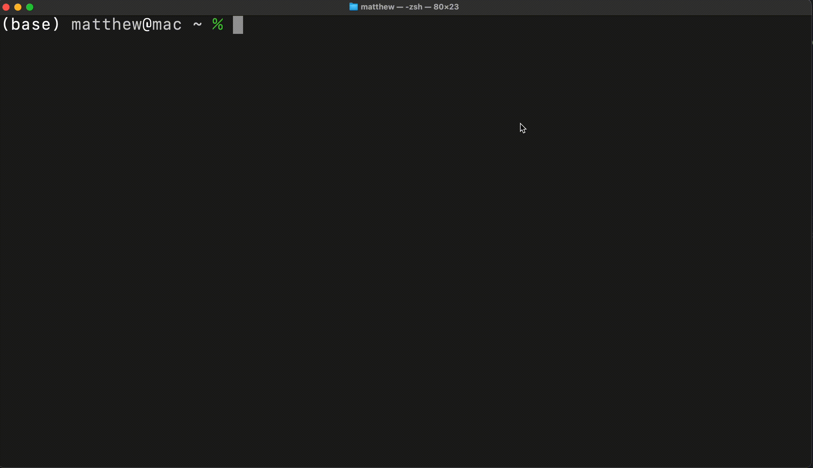

# Quantum Crafter 🚀




### Download on Homebrew

```bash
brew install mattrltrent/tap/qc
```

### Quick start

Used as `qc` + `<commands_here>`:

```bash
Usage:
----------------
  help       - shows this help message
  version    - shows tool version
  repo       - opens the GitHub repository
  gates      - lists available gates
  <circuit>  - executes the quantum circuit with the provided gates
----------------
Circuit examples:
----------------
  z2 x1 cnot0,1 cz2,3 toff1,2,3      - random gates
  h0 cnot0,1                         - creates bell pair
----------------
```

### Collaboration

- PRs welcome [here](https://github.com/mattrltrent/quantum_crafter/pulls).
- Issues [here](https://github.com/mattrltrent/quantum_crafter/issues).

### Disclaimer

This project is a work in progress and could be buggy.