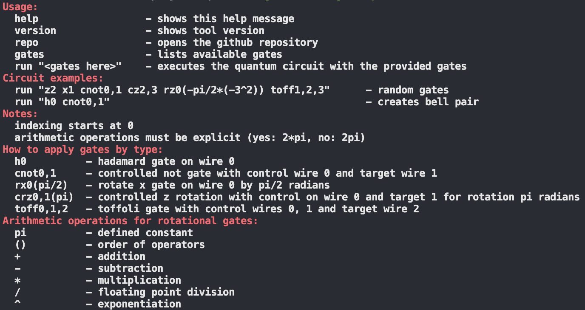

# Quantum Crafter 🚀

Create & quickly traverse quantum circuits.


### Download on Homebrew

```bash
brew install mattrltrent/tap/qc
```

### Quick start

Used as `qc` + `<commands_here>`:



### Collaboration

- PRs welcome [here](https://github.com/mattrltrent/quantum_crafter/pulls).
- Issues [here](https://github.com/mattrltrent/quantum_crafter/issues).

### Disclaimer

This project is a work in progress and could be buggy.