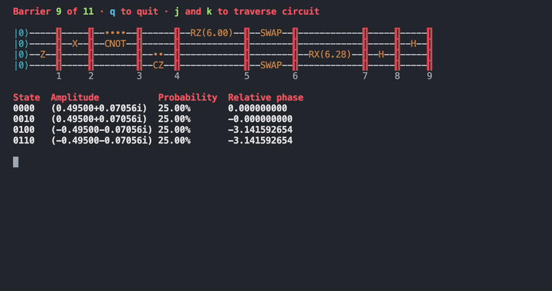

# Quantum Crafter 🚀


<div align="center">
  
</div>

### Download on Homebrew

```bash
# run this command to install or update to
# the newest version
brew install mattrltrent/tap/qc
```

### Quick start

Used as `qc` + `<commands_here>`:


### Example circuit

```bash
qc run "z2 x1 x2 rz0(-pi/2*(-3^2)) toff1,2,3 cnot0,1 cz1,2 rz0(pi/2*(-3^2)) h2 crx0,1(pi) swap0,3 cz1,2"
```

### Collaboration

- PRs welcome [here](https://github.com/mattrltrent/quantum_crafter/pulls).
- Issues [here](https://github.com/mattrltrent/quantum_crafter/issues).

### Disclaimer

This project is a work in progress and could be buggy.